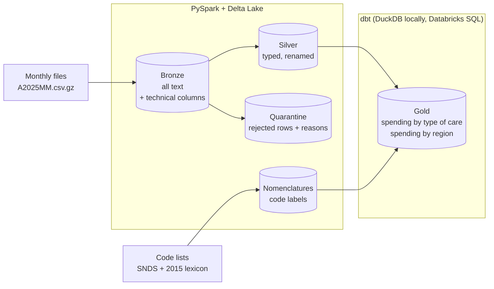

# open-damir-lakehouse

[](https://github.com/TLxFroSt/open-damir-lakehouse/actions/workflows/ci.yml)
· [🇫🇷 Français](README.md) · 🇬🇧 English

Open source lakehouse on **Open DAMIR**, the French national health insurance reimbursement
dataset (all schemes, one CSV file per month, ~35 million rows each). Bronze / silver / gold
medallion architecture with PySpark, Delta Lake and dbt, tested and documented like a
production project. The same code runs locally and on **Databricks** (serverless, Unity
Catalog, Asset Bundle), with identical results to the cent.

The code, documentation and column names are in French, like the data.

## Key numbers

On January and February 2025:

| | |
|---|---|
| Rows processed | **71.4 million** (36.6 M + 34.7 M) |
| Spending covered | **€31.6 billion** (€16.2 billion in January) |
| Bronze → silver → gold reconciliation | **to the cent**, checked on every run |
| Local vs Databricks | **identical results** (rows, amounts, gold tables) |
| Code values decoded | **99.95%** (36 of 39 columns at 100%) |
| Time per month, local | bronze ~10 min · silver ~7 min · gold **7 s** (6-core PC, 16 GB) |
| Time per month, Databricks | bronze ~11 min · silver ~1.5 min · gold ~1.5 min (serverless) |
| Tests | 98 pytest tests + 23 dbt tests, GitHub Actions CI |

## Architecture



- **Bronze**: a faithful copy of each file as a Delta table partitioned by month, every column
  as text, plus `_source_file`, `_ingested_at` and `_year_month`.
- **Silver**: 55 columns renamed and typed from an explicit schema (amounts as
  `decimal(18,2)`, months as `date`). Invalid rows go to quarantine with their reasons and are
  never deleted. Every run checks that silver + quarantine add up exactly to bronze's rows and
  spending.
- **Gold**: business aggregates built by dbt, with code labels and consistency tests against
  silver.

## Engineering decisions

Each decision is explained in an ADR (`docs/adr/`, in French).

- **Idempotent loads without MERGE.** A DAMIR row is an aggregate with no key: two identical
  rows can both be legitimate. Reloading a month replaces its partition (`replaceWhere`)
  instead of deduplicating, which would delete real spending.
  → [ADR 0001](docs/adr/0001-couche-silver.md)
- **Quarantine and reconciliation.** Values are converted with `try_cast` (Spark 4 runs in ANSI
  mode, where an invalid `cast` stops the job), each row gets its rejection reasons, and totals
  are checked on the tables read back after writing. The first run surfaced an undocumented
  "unknown date" convention (`0001/01`), now handled like the documented `0000/00`.
- **Rebuilt code lists.** The official Open DAMIR variable description is unreachable (404).
  Labels come from the Health Data Hub's SNDS code lists and the 2015 Open DAMIR lexicon, with
  the priority chosen column by column after comparing them: `AGE_BEN_SNDS = 70` means
  "70-79 years" in Open DAMIR but "70-74 years" in the SNDS age table.
  → [ADR 0002](docs/adr/0002-sources-des-nomenclatures.md), [reference/](reference/README.md)
- **dbt on DuckDB locally.** DuckDB reads the silver Delta tables directly and aggregates the
  71 M rows in 0.4 s; the SQL stays portable to Databricks.
  → [ADR 0003](docs/adr/0003-gold-dbt-duckdb.md)
- **One codebase, local or Databricks.** `storage.mode` switches between Delta folders (local)
  and Unity Catalog tables (Databricks); the wheel doesn't depend on PySpark, which serverless
  provides. The first deployment showed that Databricks SQL rejects correlated subqueries that
  DuckDB and Spark 4.2 accept: labels are now added with `LEFT JOIN`s.
  → [ADR 0004](docs/adr/0004-deploiement-databricks.md)
- **Reliable Spark startup on Windows.** Some sessions froze for about ten minutes at startup.
  A thread dump led to JDK bug [JDK-8304182](https://bugs.openjdk.org/browse/JDK-8304182)
  (a blocking read in a `java.nio.Pipe`), triggered when Spark copies the Delta jars to its
  executor. The jars are now downloaded once and passed as `local:` paths: Spark copies them
  from disk without going through that `Pipe`, and the freeze hasn't been seen since
  ([`delta_jars.py`](src/damir/common/delta_jars.py)).

## Results

Excerpt from `depenses_par_prestation`, January 2025 (labels as in the source data):

| Type of care | Spending | Reimbursed | Effective rate |
|---|---:|---:|---:|
| Pharmacie 65 % (drugs reimbursed at 65%) | €1,816.7 M | €1,544.0 M | 85.0% |
| Frais d'hébergement et environnement en GHS (hospital stays) | €813.6 M | €730.9 M | 89.8% |
| Consultation de médecine générale (GP visit) | €723.2 M | €507.4 M | 70.2% |
| Pharmacie 100 % (drugs reimbursed at 100%) | €674.1 M | €674.1 M | 100.0% |
| Actes techniques médicaux (hors imagerie) CCAM (medical procedures) | €586.9 M | €437.5 M | 74.6% |

GP visits come out at 70%, their official reimbursement rate.

## Quick start

**Prerequisites**

- [uv](https://docs.astral.sh/uv/) (installs Python 3.11 and the dependencies)
- Java 17 ([Temurin](https://adoptium.net/))
- Windows only: `winutils.exe` and `hadoop.dll` (Hadoop 3.4 build) in `C:\hadoop\bin`,
  `HADOOP_HOME=C:\hadoop`, and `C:\hadoop\bin` on the `PATH`

**Data**: download monthly files (`A202501.csv.gz`, ...) from the
[Open DAMIR page](https://www.assurance-maladie.ameli.fr/etudes-et-donnees/open-damir-depenses-sante-interregimes)
and put them in `data/raw/` (ignored by git).

```bash
uv sync                                                   # dependencies
uv run python -m damir.ingestion --year 2025 --month 1 2  # bronze
uv run python -m damir.silver --year 2025 --month 1 2     # silver + quarantine
uv run python -m damir.gold                               # gold (dbt build)
uv run pytest                                             # tests (~6 min)
```

Paths are set in [`config.yaml`](config.yaml), or through `DAMIR_<SECTION>_<KEY>` environment
variables (for example `DAMIR_PATHS_RAW_DIR`).

## Deploying to Databricks

With the [Databricks CLI](https://docs.databricks.com/dev-tools/cli/) logged into a workspace
(`databricks auth login --host <workspace url>`):

```bash
databricks bundle deploy               # bronze/silver/gold schemas, raw volume, job
databricks fs cp data/raw/A202501.csv.gz dbfs:/Volumes/workspace/bronze/raw/
databricks bundle run damir_pipeline   # bronze -> silver -> dbt build (year, months)
```

The job ([`databricks.yml`](databricks.yml)) uses
[`config.databricks.yaml`](config.databricks.yaml): `workspace.bronze.*`, `workspace.silver.*`
and `workspace.gold.*` tables in Unity Catalog.

## Layout

```
src/damir/
  ingestion/   CSV.gz -> bronze (Delta), CLI
  silver/      typing, quarantine, reconciliation, code lists, CLI
  gold/        runs dbt with the project configuration
  reference/   builds the code list file
  common/      configuration, Spark session, silver schema, Delta tables and writes
dbt/           gold models (staging, marts), macros, generic tests
databricks.yml Asset Bundle: Databricks schemas, volume and job
reference/     versioned code lists (generated) and justified additions
docs/          silver columns (generated) and ADRs
tests/         unit and integration tests on synthetic data
```

## Limitations and next steps

- Three codes have no label because no source covers them (`PRS_PDS_QCP = 34`,
  `PRS_REM_TYP = 11/12/13`, `DDP_SPE_COD = 46`); the label for region `5` (Corsica and overseas
  regions) is deduced from the data and still to be confirmed.
- Coming next: automatic download of the monthly files and job scheduling.

## Data and licenses

- Open DAMIR: © Caisse nationale de l'Assurance Maladie,
  [Licence Ouverte](https://www.etalab.gouv.fr/licence-ouverte-open-licence/).
- SNDS code lists: the Health Data Hub's
  [schema-snds](https://gitlab.com/healthdatahub/applications-du-hdh/schema-snds) repository,
  MPL 2.0 license.
