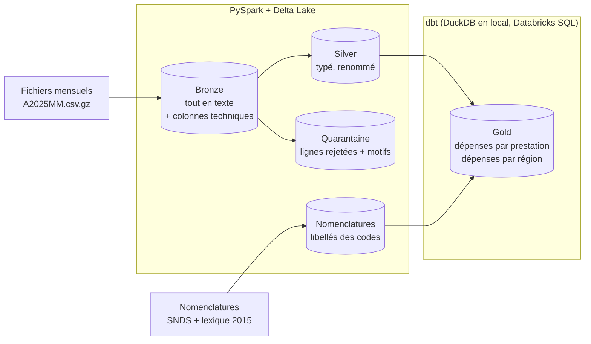

# open-damir-lakehouse

[](https://github.com/TLxFroSt/open-damir-lakehouse/actions/workflows/ci.yml)
· 🇫🇷 Français · [🇬🇧 English](README.en.md)

Lakehouse open source sur **Open DAMIR**, la base des remboursements de l'Assurance Maladie
(tous régimes, un fichier CSV par mois, ~35 millions de lignes chacun). Architecture médaillon
bronze / silver / gold avec PySpark, Delta Lake et dbt, testée et documentée comme un projet de
production. Le même code tourne en local et sur **Databricks** (serverless, Unity Catalog,
Asset Bundle), avec des résultats identiques au centime.

## En chiffres

Sur janvier et février 2025 :

| | |
|---|---|
| Lignes traitées | **71,4 millions** (36,6 M + 34,7 M) |
| Dépense couverte | **31,6 Md€** (16,2 Md€ en janvier) |
| Rapprochement bronze → silver → gold | **au centime près**, vérifié à chaque exécution |
| Local et Databricks | **résultats identiques** (lignes, montants, tables gold) |
| Valeurs de codes décodées | **99,95 %** (36 colonnes sur 39 à 100 %) |
| Temps par mois, local | bronze ~10 min · silver ~7 min · gold **7 s** (PC 6 cœurs, 16 Go) |
| Temps par mois, Databricks | bronze ~11 min · silver ~1,5 min · gold ~1,5 min (serverless) |
| Tests | 98 tests pytest + 23 tests dbt, CI GitHub Actions |

## Architecture



- **Bronze** : copie fidèle de chaque fichier en table Delta partitionnée par mois, toutes les
  colonnes en texte, plus `_source_file`, `_ingested_at` et `_year_month`.
- **Silver** : 55 colonnes renommées en français et typées selon un schéma explicite
  (montants en `decimal(18,2)`, mois en `date`). Les lignes invalides vont en quarantaine avec
  leurs motifs, jamais supprimées. Chaque exécution vérifie que silver + quarantaine redonnent
  exactement les lignes et la dépense du bronze.
- **Gold** : agrégats métier construits par dbt, avec les libellés des codes et des tests de
  cohérence avec le silver.

## Choix techniques

Chaque décision est expliquée dans un ADR (`docs/adr/`).

- **Chargement idempotent sans MERGE.** Une ligne DAMIR est un agrégat sans clé : deux lignes
  identiques peuvent être légitimes. Recharger un mois remplace sa partition
  (`replaceWhere`) au lieu de dédoublonner, ce qui supprimerait de la dépense réelle.
  → [ADR 0001](docs/adr/0001-couche-silver.md)
- **Quarantaine et rapprochement.** Conversion par `try_cast` (Spark 4 tourne en mode ANSI,
  où un `cast` invalide arrête le job), motifs de rejet par ligne, contrôle des totaux sur les
  tables relues après écriture. Le premier passage a révélé une convention de date inconnue non
  documentée (`0001/01`), traitée ensuite comme `0000/00`.
- **Nomenclatures reconstituées.** Le descriptif officiel Open DAMIR est inaccessible (404).
  Les libellés viennent des nomenclatures SNDS du Health Data Hub et du lexique Open DAMIR de
  2015, avec une priorité choisie colonne par colonne après comparaison : `AGE_BEN_SNDS = 70`
  signifie « 70 - 79 ans » dans Open DAMIR mais « 70 - 74 ans » dans la table SNDS des âges.
  → [ADR 0002](docs/adr/0002-sources-des-nomenclatures.md), [reference/](reference/README.md)
- **dbt sur DuckDB en local.** DuckDB lit les tables Delta du silver directement et agrège les
  71 M de lignes en 0,4 s ; le SQL reste portable vers Databricks.
  → [ADR 0003](docs/adr/0003-gold-dbt-duckdb.md)
- **Un même code, local ou Databricks.** `storage.mode` choisit entre dossiers Delta (local) et
  tables Unity Catalog (Databricks) ; le wheel ne dépend pas de PySpark, fourni par le serverless.
  Le premier déploiement a montré que Databricks SQL refuse des sous-requêtes corrélées que
  DuckDB et Spark 4.2 acceptent : les libellés passent désormais par des `LEFT JOIN`.
  → [ADR 0004](docs/adr/0004-deploiement-databricks.md)
- **Démarrage de Spark fiabilisé sous Windows.** Certaines sessions se figeaient une dizaine de
  minutes au démarrage. Un vidage de threads a mené au bug JDK
  [JDK-8304182](https://bugs.openjdk.org/browse/JDK-8304182) (lecture bloquante dans un
  `java.nio.Pipe`), déclenché par la copie des jars Delta vers l'exécuteur. Les jars sont
  désormais téléchargés une fois et passés en chemins `local:` : Spark les copie depuis le disque
  sans passer par ce `Pipe`, et le blocage n'a plus été observé
  ([`delta_jars.py`](src/damir/common/delta_jars.py)).

## Résultats

Extrait de `depenses_par_prestation`, janvier 2025 :

| Nature de prestation | Dépense | Remboursé | Taux effectif |
|---|---:|---:|---:|
| Pharmacie 65 % | 1 816,7 M€ | 1 544,0 M€ | 85,0 % |
| Frais d'hébergement et environnement en GHS | 813,6 M€ | 730,9 M€ | 89,8 % |
| Consultation de médecine générale | 723,2 M€ | 507,4 M€ | 70,2 % |
| Pharmacie 100 % | 674,1 M€ | 674,1 M€ | 100,0 % |
| Actes techniques médicaux (hors imagerie) CCAM | 586,9 M€ | 437,5 M€ | 74,6 % |

La consultation de médecine générale ressort à 70 %, son taux de remboursement officiel.

## Démarrage rapide

**Prérequis**

- [uv](https://docs.astral.sh/uv/) (installe Python 3.11 et les dépendances)
- Java 17 ([Temurin](https://adoptium.net/))
- Windows uniquement : `winutils.exe` et `hadoop.dll` (build Hadoop 3.4) dans `C:\hadoop\bin`,
  variable `HADOOP_HOME=C:\hadoop` et `C:\hadoop\bin` dans le `PATH`

**Données** : télécharger des fichiers mensuels (`A202501.csv.gz`, ...) depuis la
[page Open DAMIR](https://www.assurance-maladie.ameli.fr/etudes-et-donnees/open-damir-depenses-sante-interregimes)
et les placer dans `data/raw/` (dossier ignoré par git).

```bash
uv sync                                                   # dépendances
uv run python -m damir.ingestion --year 2025 --month 1 2  # bronze
uv run python -m damir.silver --year 2025 --month 1 2     # silver + quarantaine
uv run python -m damir.gold                               # gold (dbt build)
uv run pytest                                             # tests (~6 min)
```

Les chemins se règlent dans [`config.yaml`](config.yaml), ou par variable d'environnement
`DAMIR_<SECTION>_<CLE>` (par exemple `DAMIR_PATHS_RAW_DIR`).

## Déploiement sur Databricks

Avec la [CLI Databricks](https://docs.databricks.com/dev-tools/cli/) connectée à un workspace
(`databricks auth login --host <url du workspace>`) :

```bash
databricks bundle deploy               # schémas bronze/silver/gold, volume raw, job
databricks fs cp data/raw/A202501.csv.gz dbfs:/Volumes/workspace/bronze/raw/
databricks bundle run damir_pipeline   # bronze -> silver -> dbt build (year, months)
```

Le job ([`databricks.yml`](databricks.yml)) utilise
[`config.databricks.yaml`](config.databricks.yaml) : tables `workspace.bronze.*`,
`workspace.silver.*` et `workspace.gold.*` dans Unity Catalog.

## Structure

```
src/damir/
  ingestion/   CSV.gz -> bronze (Delta), CLI
  silver/      typage, quarantaine, rapprochement, nomenclatures, CLI
  gold/        lancement de dbt avec la configuration du projet
  reference/   construction du fichier de nomenclatures
  common/      configuration, session Spark, schéma silver, tables et écritures Delta
dbt/           modèles gold (staging, marts), macros, tests génériques
databricks.yml Asset Bundle : schémas, volume et job Databricks
reference/     nomenclatures versionnées (générées) et compléments justifiés
docs/          colonnes du silver (générée) et ADR
tests/         tests unitaires et d'intégration sur données synthétiques
```

## Limites et suite

- Trois codes restent sans libellé faute de source (`PRS_PDS_QCP = 34`,
  `PRS_REM_TYP = 11/12/13`, `DDP_SPE_COD = 46`) ; le libellé de la région `5` (Corse et
  outre-mer) est déduit des données, à confirmer.
- À venir : téléchargement automatique des fichiers mensuels et planification du job.

## Données et licences

- Open DAMIR : © Caisse nationale de l'Assurance Maladie,
  [Licence Ouverte](https://www.etalab.gouv.fr/licence-ouverte-open-licence/).
- Nomenclatures SNDS : dépôt [schema-snds](https://gitlab.com/healthdatahub/applications-du-hdh/schema-snds)
  du Health Data Hub, licence MPL 2.0.
